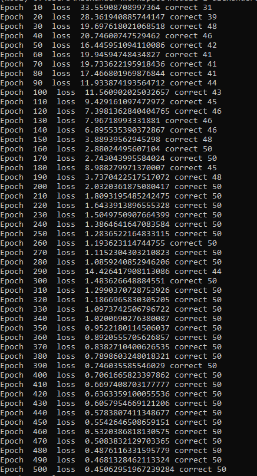
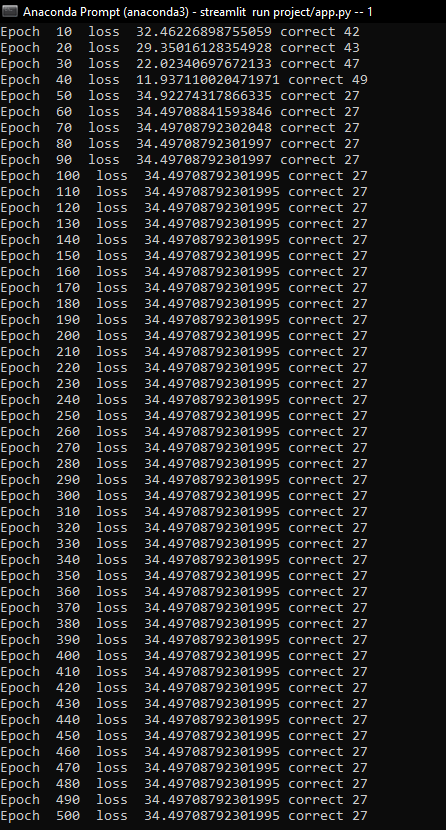
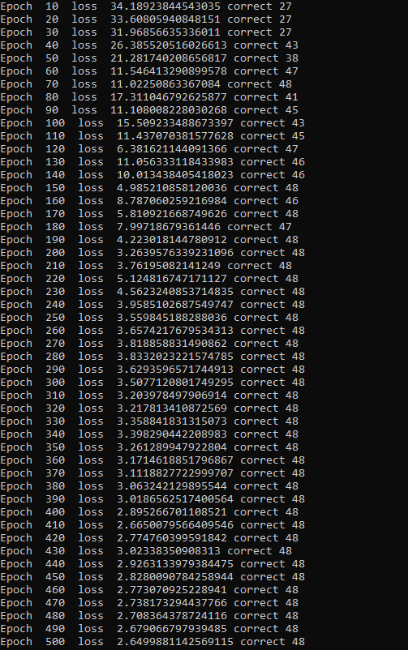
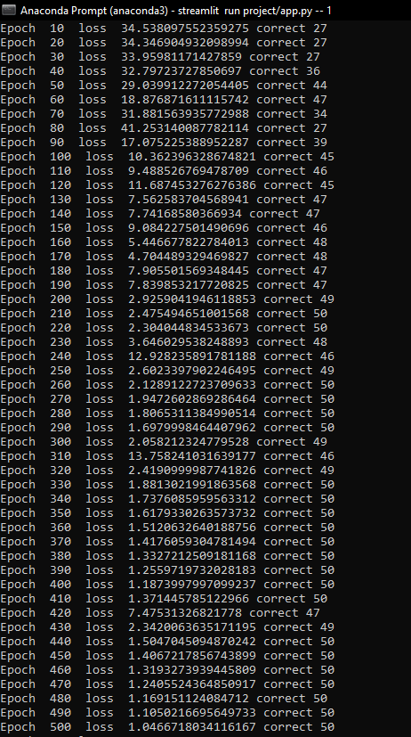
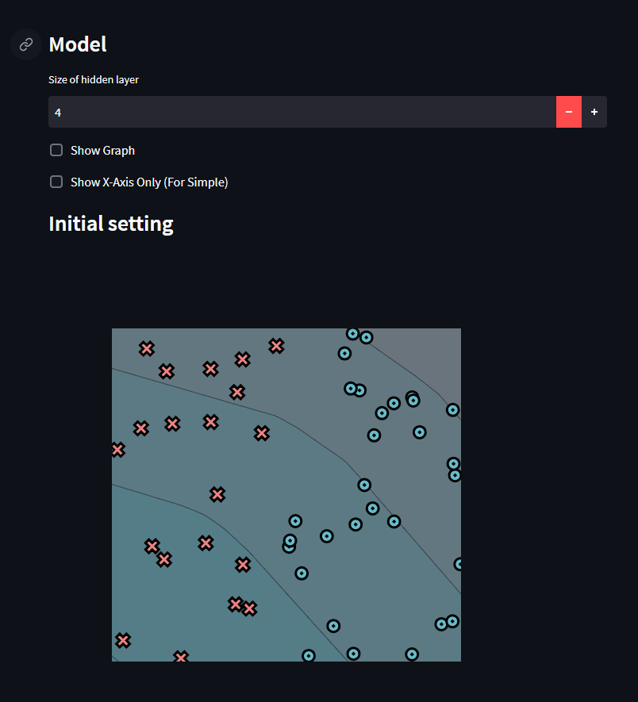
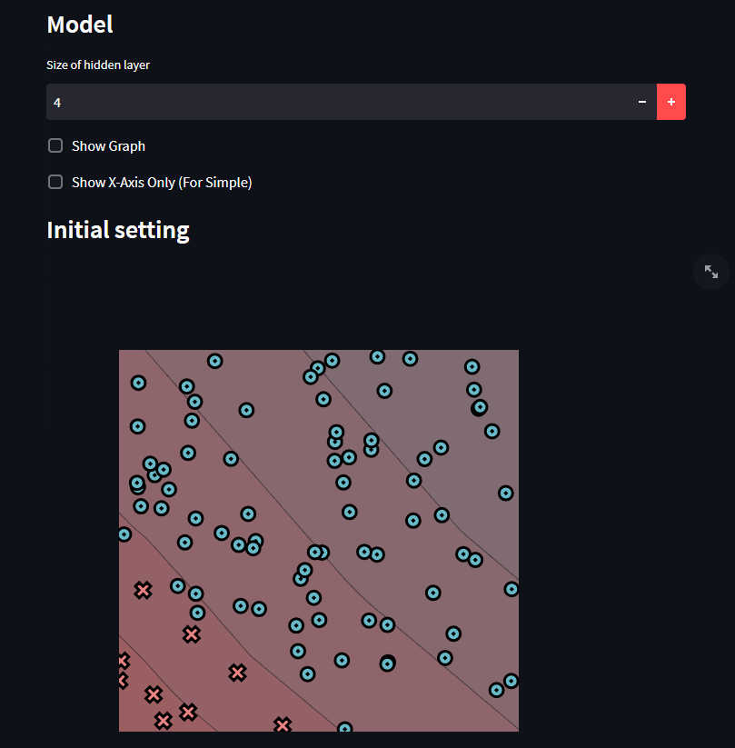
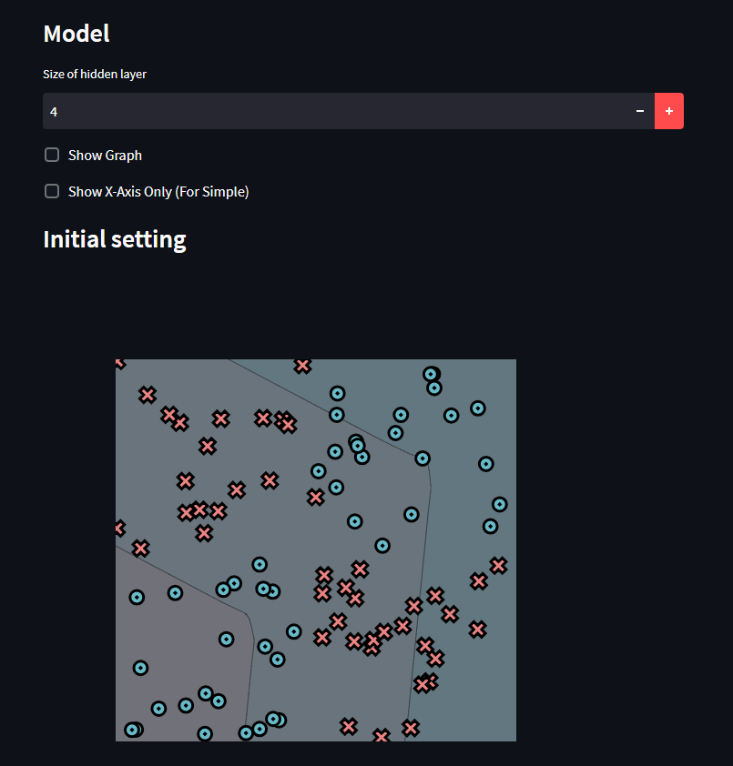
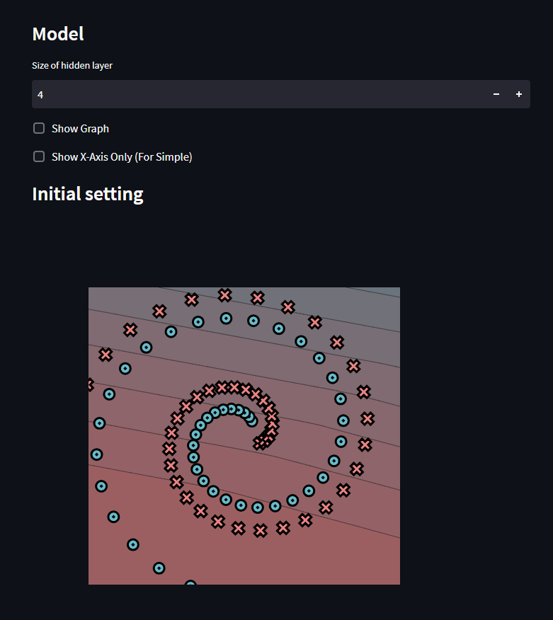

# MiniTorch Module 1


* Docs: https://minitorch.github.io/

* Overview: https://minitorch.github.io/module1/module1/

This assignment requires the following files from the previous assignments. You can get these by running

```bash
python sync_previous_module.py previous-module-dir current-module-dir
```

The files that will be synced are:

        minitorch/operators.py minitorch/module.py tests/test_module.py tests/test_operators.py project/run_manual.py


## output training logs

1. Simple.png 
* 
2. Diag.png 
* 
3. Xor.png 
* 
4. Spiral.png 
* 

### final images:
- Simple_fig.png 
- Diag_fig.png 
- Xor_fig.png 
- Spiral_fig.png 
